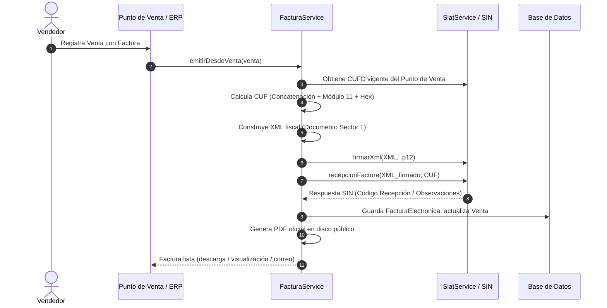

# 📘 MANUAL DE ENTREGA TÉCNICA Y DOCUMENTACIÓN INTEGRAL DEL SISTEMA

**Proyecto:** GISECA ERP — Sistema de Gestión Comercial, Inventario, Comprobantes y Facturación Electrónica SIAT  
**Versión Actual:** 3.0 (Núcleo ERP Estable + Facturación Electrónica en Línea + Multisucursal Completa)  
**Fecha de Entrega:** Septiembre 2026  
**Audiencia:** Equipo de Desarrollo, Desarrolladores Continuadores del Proyecto, Administradores de Sistemas y Líderes Técnicos  

---

## 📑 TABLA DE CONTENIDOS

1. [Ficha Técnica del Proyecto](#1-ficha-técnica-del-proyecto)
2. [Estructura del Proyecto y Organización del Código](#2-estructura-del-proyecto-y-organización-del-código)
3. [Instalación, Despliegue y Puesta en Marcha](#3-instalación-despliegue-y-puesta-en-marcha)
4. [Módulo de Facturación Electrónica SIAT (Guía Maestra)](#4-módulo-de-facturación-electrónica-siat-guía-maestra)
   - 4.1. Modos de Operación: Simulador vs. Real (Piloto / Producción)
   - 4.2. Dónde y Cómo Configurar los Tokens, Certificados y Claves
   - 4.3. Tabla de Parámetros Fiscales y Claves de Configuración
   - 4.4. Ciclo de Vida Fiscal (CUIS → CUFD → CUF → XML → Firma → Recepción)
   - 4.5. Algoritmo CUF (Concatenación + Módulo 11 + Hexadecimal)
   - 4.6. Firma Digital XMLDSig (RSA-SHA256 con `.p12`)
   - 4.7. Formatos de Impresión PDF (Carta, Medio Oficio, Rollo 80mm, Rollo 58mm)
   - 4.8. Envío y Notificación por Correo Electrónico (PDF + XML adjuntos)
   - 4.9. Anulación y Reversión con Validación Legal SIN (Plazo Día 9)
   - 4.10. Notas de Débito y Crédito (Documento Sector 24)
5. [Arquitectura Multisucursal y Puntos de Venta (POS)](#5-arquitectura-multisucursal-y-puntos-de-venta-pos)
   - 5.1. Modelos de Datos y Relaciones
   - 5.2. Contexto de Sesión y Fallback Inteligente (`SucursalContext`)
   - 5.3. Correlativos y Series Fiscales por Punto de Venta
6. [Manejo de Contingencias y Empaquetado Masivo](#6-manejo-de-contingencias-y-empaquetado-masivo)
   - 6.1. Eventos Significativos (Códigos 1 al 7)
   - 6.2. Emisión Fuera de Línea con CAFC
   - 6.3. Empaquetado `.tar.gz`, Envío y Validación de Paquetes
7. [Catálogos Oficiales y Homologación de Productos](#7-catálogos-oficiales-y-homologación-de-productos)
   - 7.1. Los 8 Catálogos Paramétricos del SIN
   - 7.2. Asistente de Homologación de Productos (`codigo_sin`, `unidad_sin`)
8. [Módulos del ERP (Visión General)](#8-módulos-del-erp-visión-general)
   - 8.1. Ventas y Clientes
   - 8.2. Compras y Proveedores
   - 8.3. Inventario, Kardex y Costeo Promedio
   - 8.4. Caja, Cuentas por Cobrar y Pagar
   - 8.5. Seguridad, Roles y Permisos
9. [Guía para el Desarrollador Continuador (Paso a Producción / Tareas Pendientes)](#9-guía-para-el-desarrollador-continuador-paso-a-producción--tareas-pendientes)
   - 9.1. Pasos para conectar a Piloto o Producción del SIN
   - 9.2. Automatizaciones Recomendadas (Cron de CUFD)
   - 9.3. Suite de Pruebas Automatizadas (PHPUnit)

---

## 1. FICHA TÉCNICA DEL PROYECTO

| Parámetro | Detalle |
| :--- | :--- |
| **Framework Backend** | Laravel 13.x (PHP 8.4 / 8.5) |
| **Arquitectura** | MVC desacoplado con Capa de Servicios (`app/Services/`) |
| **Motor de Base de Datos** | MySQL 8.x / MariaDB 10.4+ (Testing con SQLite `:memory:`) |
| **Frontend / Vistas** | Blade + Vanilla CSS + Bootstrap Icons (`resources/css/giseca.css`) |
| **Motor de PDFs** | `barryvdh/laravel-dompdf` (DomPDF v3.1) |
| **Códigos de Barras** | `picqer/php-barcode-generator` |
| **Comunicación Fiscal** | SOAP Client nativo de PHP con soporte WSDL y criptografía `OpenSSL` |
| **Estándar de Código** | PSR-12 / Laravel Pint (`vendor/bin/pint --format agent`) |
| **Pruebas Automatizadas** | PHPUnit 12.x (95 pruebas automatizadas de integración y features) |

---

## 2. ESTRUCTURA DEL PROYECTO Y ORGANIZACIÓN DEL CÓDIGO

```text
giseca-erp/
├── app/
│   ├── Http/Controllers/
│   │   ├── AuthController.php              # Login, logout y autenticación
│   │   ├── CatalogoController.php          # Sincronización y consulta de catálogos SIN
│   │   ├── FacturaController.php           # Emisión, PDFs, correo, anulación y reversión
│   │   ├── SucursalController.php          # CRUD sucursales, POS, CUIS, CUFD y cambio de contexto
│   │   ├── EventoContingenciaController.php# Apertura, cierre y empaquetado de contingencias
│   │   ├── VentaController.php             # Flujo comercial, importadores y cobranzas
│   │   ├── CompraController.php            # Compras, gastos y crédito fiscal
│   │   ├── ProductoController.php          # Catálogo de inventario con homologación SIN
│   │   ├── CajaController.php              # Caja diaria y cuentas por cobrar/pagar
│   │   └── KardexController.php            # Movimientos de inventario valorizado
│   ├── Mail/
│   │   └── FacturaCorreo.php               # Mailable que adjunta automáticamente PDF y XML firmado
│   ├── Models/
│   │   ├── CatalogoSin.php                 # Tablas paramétricas del SIN
│   │   ├── Configuracion.php               # Parámetros generales y fiscales en BD
│   │   ├── DetalleVenta.php                # Items de cada comprobante de venta
│   │   ├── EventoContingencia.php          # Registro de eventos significativos (1-7)
│   │   ├── EventoSiat.php                  # Bitácora de auditoría SOAP
│   │   ├── FacturaElectronica.php          # Documento fiscal emitido (CUF, CUFD, XML, estado)
│   │   ├── NotaFiscal.php                  # Notas de débito y crédito
│   │   ├── PuntoVenta.php                  # Puntos de venta / cajas por sucursal
│   │   ├── Sucursal.php                    # Sucursales físicas de la empresa
│   │   ├── User.php                        # Usuarios con rol, sucursal y POS asignados
│   │   └── Venta.php                       # Comprobante comercial de venta
│   └── Services/
│       ├── FacturaService.php              # Orquestador del flujo de emisión, anulación y PDFs
│       ├── NitHelper.php                   # Verificación local y algoritmo de validación de NIT/CI
│       ├── SiatConfig.php                  # Acceso encriptado a credenciales y estado del SIAT
│       ├── SiatService.php                 # Cliente SOAP oficial y motor de simulación fiscal
│       └── SucursalContext.php             # Manejo de la sucursal y POS activo en sesión
├── database/
│   ├── migrations/                         # Esquema de base de datos relacional
│   └── seeders/
│       ├── DatabaseSeeder.php              # Seeder maestro
│       ├── CatalogoSinSeeder.php           # Carga inicial de datos paramétricos oficiales SIN
│       └── SucursalSeeder.php              # Carga inicial de Casa Matriz y POS 0
├── resources/views/
│   ├── catalogos/index.blade.php           # UI de consulta y sincronización de catálogos
│   ├── sucursales/index.blade.php          # Gestión integral de sucursales, POS, CUIS y CUFD
│   ├── facturas/
│   │   ├── index.blade.php                 # Listado fiscal con filtros de estado y sucursal
│   │   ├── show.blade.php                  # Detalle fiscal, QR, reenvío y acciones
│   │   ├── pdf.blade.php                   # Plantilla oficial formato CARTA
│   │   ├── pdf-medio-oficio.blade.php      # Plantilla oficial formato MEDIO OFICIO (Half-Letter)
│   │   ├── pdf-rollo.blade.php             # Plantilla térmica ROLLO 80mm
│   │   └── pdf-rollo-58.blade.php          # Plantilla térmica ROLLO 58mm
│   └── productos/index.blade.php           # Catálogo con autocompletado en vivo de código/unidad SIN
└── tests/
    └── Feature/
        ├── CatalogoTest.php                # Pruebas de catálogos y búsquedas
        ├── MultisucursalTest.php           # Pruebas de CRUD, POS, CUIS, CUFD y emisión multisucursal
        └── FacturaImpresionYReversionTest.php # Pruebas de los 4 PDFs, anulación, plazo legal y correos
```

---

## 3. INSTALACIÓN, DESPLIEGUE Y PUESTA EN MARCHA

### 3.1. Requisitos del Sistema
- **PHP:** 8.4 o superior (Compatible con PHP 8.5).
- **Extensiones PHP Requeridas:**
  - `php_soap` (Indispensable para comunicación WebServices SIN).
  - `php_openssl` (Firma digital XMLDSig y encriptación de credenciales).
  - `php_pdo_mysql` / `php_mysqli` (Base de datos).
  - `php_mbstring`, `php_dom`, `php_xml`, `php_gd`, `php_bcmath`, `php_curl`, `php_zip`.
- **Servidor Web:** Apache (vía XAMPP) con `mod_rewrite` habilitado o Nginx.
- **Node.js:** v18+ y NPM (para assets si se utiliza Vite).

### 3.2. Paso a Paso de Instalación

1. **Clonar o situar el repositorio:**
   ```bash
   cd c:\xampp\htdocs\giseca-erp
   ```

2. **Instalar dependencias de PHP:**
   ```bash
   composer install
   ```

3. **Configurar archivo de entorno `.env`:**
   ```bash
   copy .env.example .env
   php artisan key:generate
   ```
   Asegurar las credenciales de base de datos:
   ```env
   DB_CONNECTION=mysql
   DB_HOST=127.0.0.1
   DB_PORT=3306
   DB_DATABASE=giseca_erp
   DB_USERNAME=root
   DB_PASSWORD=
   ```

4. **Ejecutar migraciones y seeders:**
   ```bash
   php artisan migrate --force
   php artisan db:seed --force
   ```
   *Nota:* Esto creará automáticamente las tablas del ERP, la **Casa Matriz (Código 0)**, la **Caja Central (POS 0)** y los **Catálogos Oficiales del SIN**.

5. **Compilar assets / enlace simbólico de Storage:**
   ```bash
   php artisan storage:link
   npm install
   npm run build
   ```

6. **Ejecución local:**
   - Vía XAMPP Apache: `http://localhost/giseca-erp/public`
   - O vía CLI: `php artisan serve` (`http://127.0.0.1:8000`)

---

## 4. MÓDULO DE FACTURACIÓN ELECTRÓNICA SIAT (GUÍA MAESTRA)

### 4.1. Modos de Operación

El sistema cuenta con un conmutador fundamental en [SiatConfig.php](file:///c:/xampp/htdocs/giseca-erp/app/Services/SiatConfig.php):

1. **Modo `simulador` (Por Defecto en Desarrollo / Pruebas):**
   - No realiza peticiones HTTP/SOAP externas ni requiere internet.
   - Genera respuestas deterministas simuladas por el SIN (prefijos `SIM-CUIS-`, `SIM-CUFD-`, `SIM-RECEPCION-`).
   - Simula la firma enveloped en el XML y permite probar el 100% de los flujos de ventas, emisión, generación de PDFs, envío de correos, anulaciones y contingencias.
   - Todas las llamadas se auditan en la tabla `eventos_siat`.

2. **Modo `real` (Entorno Piloto o Producción del SIN):**
   - Consume los WebServices SOAP oficiales del SIN.
   - Requiere Token Delegado vigente, NIT emisor, Código de Sistema y el archivo de certificado digital `.p12`.

### 4.2. Dónde y Cómo Configurar los Tokens, Certificados y Claves

> [!IMPORTANT]
> **Seguridad Fiscal:** Por diseño y seguridad, las credenciales sensibles del SIN (Token Delegado, Contraseña del Certificado `.p12` y Archivo Criptográfico) **NO se guardan en texto plano en el archivo `.env`** para evitar fugas en repositorios Git. Se gestionan de forma centralizada y se guardan **encriptadas con AES-256** (`Illuminate\Support\Facades\Crypt`) en la tabla `configuraciones` de la base de datos.

Existen dos vías para configurar los parámetros:

#### Vía 1: A través del Panel Web Administrativo (Recomendada)
1. Iniciar sesión en el ERP con un usuario con rol de Administrador.
2. Ingresar en el menú lateral a **Configuración** (`/configuracion`).
3. Desplazarse hasta la tarjeta inferior: **"Facturación Electrónica SIAT"**.
4. Completar los campos con los datos oficiales entregados por el SIN:
   - **Modo:** Cambiar a `Real (SIN)` para conectar con los servidores tributarios (dejar en `Simulador` para pruebas internas sin internet).
   - **Ambiente:** Seleccionar `Pruebas (piloto)` para ambiente de pruebas/homologación, o `Producción` para emisión fiscal real.
    - **Modalidad:** `Computarizada en Línea` (modalidad por defecto de GISECA; sin firma ni certificado). Cambiar a `Electrónica en Línea` solo si se cuenta con certificado digital `.p12`.
   - **NIT emisor:** Ingresar el NIT de la empresa (solo números).
   - **Razón social:** Nombre o razón social idéntica a la registrada en el Padrón Nacional de Contribuyentes.
   - **Código de sistema:** Código alfanumérico otorgado por el SIN al registrar el sistema informático de la empresa.
   - **Certificado .p12 (privado):** Hacer clic en *Examinar / Seleccionar archivo* y subir el certificado digital `.p12` o `.pfx` provisto por la entidad certificadora (ADSIB o Digicert). El sistema lo almacena automáticamente en el disco privado `storage/app/siat/` (inaccesible vía web pública).
   - **Contraseña certificado:** Escribir la contraseña de la clave privada del archivo `.p12`. Se almacenará cifrada.
   - **Token Delegado:** Pegar el token de autenticación generado en el portal del contribuyente SIAT en Línea (token JWT extenso). Se almacenará cifrado.
5. Hacer clic en el botón verde **"Guardar SIAT"**.
6. Hacer clic en **"Probar conexión (CUIS + CUFD)"**: el sistema consumirá el servicio SOAP del SIN y verificará que las credenciales, el token y el certificado sean válidos, actualizando el CUIS y CUFD en pantalla.

---

#### Vía 2: Desde Consola CLI / Tinker (Para Despliegues Automatizados o Servidores Headless)
Si estás en un servidor remoto o deseas inyectar los datos por consola:

1. Colocar el archivo del certificado `.p12` en la ruta privada:
   `storage/app/siat/empresa.p12`
2. Ejecutar Laravel Tinker:
   ```bash
   php artisan tinker
   ```
3. Ejecutar el siguiente bloque en PHP:
   ```php
   \App\Services\SiatConfig::guardar([
       'siat_modo' => 'real',
       'siat_ambiente' => 'pruebas', // o 'produccion'
       'siat_modalidad' => 'electronica',
       'siat_nit' => '1020304050',
       'siat_razon_social' => 'GISECA SRL',
       'siat_codigo_sistema' => 'A1B2C3D4E5F6G7H',
       'siat_token' => 'Bearer eyJhbGciOiJSUzI1NiIs...', // Token Delegado completo
       'siat_cert_password' => 'TuClavePrivadaDelP12',
       'siat_certificado_path' => 'siat/empresa.p12',
       'siat_sucursal' => '0',
       'siat_punto_venta' => '0',
       'siat_direccion' => 'Av. Principal #100',
       'siat_ciudad' => 'Santa Cruz de la Sierra',
       'siat_telefono' => '33445566',
   ]);
   ```

---

### 4.3. Tabla de Parámetros Fiscales y Claves de Configuración

| Clave en BD (`configuraciones`) | Tipo | Descripción | Dónde se Obtiene / Ejemplo |
| :--- | :--- | :--- | :--- |
| `siat_modo` | Texto | Controla si simula localmente o contacta al SIN | `simulador` o `real` |
| `siat_ambiente` | Texto | Entorno de destino en los WebServices SOAP | `pruebas` (Piloto) o `produccion` |
| `siat_modalidad` | Texto | Tipo de modalidad | `electronica` (1) o `computarizada` (2) |
| `siat_nit` | Texto | NIT del contribuyente emisor | Otorgado por el SIN (Padrón Biométrico) |
| `siat_razon_social` | Texto | Razón Social legal | Documento de Identificación Tributaria |
| `siat_codigo_sistema` | Texto | Identificador del sistema informático | Portal SIAT en Línea (Registro de Sistemas) |
| `siat_token` | Secreto | Token Delegado para consumir servicios SOAP | Portal SIAT en Línea (Gestión de Usuarios / API) |
| `siat_cert_password`| Secreto | Contraseña de protección del `.p12` | Clave elegida al emitir el certificado |
| `siat_certificado_path`| Archivo| Ruta interna en `storage/app/` al archivo `.p12` | `siat/{nombre_archivo}.p12` |
| `siat_cuis` | Texto | Código Único de Inicio de Sistemas | Generado vía botón *"Obtener CUIS"* |
| `siat_cufd` | Texto | Código Único de Facturación Diaria | Generado vía botón *"Obtener CUFD"* |
| `siat_cafc` | Texto | Código de Contingencia para emisión fuera de línea | Otorgado por el SIN al autorizar talonario |

### 4.4. Ciclo de Vida Fiscal

Cada emisión de factura sigue un flujo secuencial y transaccional riguroso:



### 4.5. Algoritmo CUF (Código Único de Facturación)

El CUF se calcula siguiendo la especificación técnica del SIN:
1. **Concatenación:**
   - NIT emisor (13 dígitos con ceros a la izquierda).
   - Fecha y hora formato `YmdHisv` (17 dígitos: milisegundos a 3 dígitos).
   - Sucursal (4 dígitos).
   - Modalidad (1 dígito: 1=Electrónica, 2=Computarizada).
   - Tipo de Emisión (1 dígito: 1=En línea, 2=Fuera de línea/Contingencia).
   - Tipo de Factura (1 dígito: 1=Con derecho a crédito fiscal).
   - Tipo Documento Sector (2 dígitos: 01=Compra-Venta).
   - Número de Factura (10 dígitos).
   - Punto de Venta (4 dígitos).
2. **Dígito Verificador (Módulo 11):**
   - Ponderador base de 2 a 9 de derecha a izquierda.
   - El residuo define el dígito (si es 10 el dígito es 1; si es 11 es 0).
3. **Hexadecimal Base 16:**
   - La cadena numérica resultante se convierte a representación Hexadecimal en mayúsculas utilizando aritmética de precisión arbitraria (`bcmath`) para evitar desbordamientos de enteros de 64 bits.

### 4.6. Firma Digital XMLDSig

- Implementado en `SiatService::firmarXml`.
- En modo real: utiliza `openssl_pkcs12_read()` para extraer el certificado X.509 y la clave privada del `.p12`.
- Realiza la canonicalización C14N del XML, genera el digest SHA-256 de los datos, firma el bloque `<SignedInfo>` con algoritmo `RSA-SHA256` e incrusta el nodo `<Signature>` conforme al estándar enveloped XMLDSig.

### 4.7. Formatos de Impresión PDF

El sistema implementa 4 formatos oficiales renderizados con DomPDF:

| Formato | Ruta / Endpoint | Dimensiones de Papel | Uso Recomendado |
| :--- | :--- | :--- | :--- |
| **Carta** | `/facturas/{id}/pdf` | `letter` (8.5" x 11") | Envío a clientes corporativos, licitaciones y archivo contable. |
| **Medio Oficio** | `/facturas/{id}/pdf-medio-oficio` | `[0, 0, 396, 612]` (5.5" x 8.5") | Impresión económica de mostrador en impresoras láser/inyección. |
| **Rollo 80mm** | `/facturas/{id}/pdf-rollo` | `[0, 0, 226.77, 800]` | Impresoras térmicas estándar de punto de venta (POS). |
| **Rollo 58mm** | `/facturas/{id}/pdf-rollo-58` | `[0, 0, 164.41, 800]` | Impresoras térmicas compactas portátiles o de mostrador estrecho. |

*Todos los formatos incluyen:* Razón social, NIT, datos de la sucursal emisora, punto de venta, detalle de ítems, totales, son en letras, CUF, CUFD, código de recepción SIN, leyenda oficial y **Código QR fiscal** escaneable directamente hacia el portal de verificación del SIN:
`https://siat.impuestos.gob.bo/consulta/QR?nit={nit}&cuf={cuf}&numero={numero}&t=2`

### 4.8. Envío y Notificación por Correo Electrónico

- Clase mailable: [FacturaCorreo.php](file:///c:/xampp/htdocs/giseca-erp/app/Mail/FacturaCorreo.php).
- **Archivos Adjuntos:** Adjunta automáticamente tanto la representación gráfica en PDF oficial como el XML firmado digitalmente (`.xml`).
- Se dispara automáticamente tras la emisión si el cliente posee correo registrado.
- Dispone de botón y modal en la vista `/facturas/{id}` para ingresar o cambiar el correo y reenviar la factura en cualquier momento.

### 4.9. Anulación y Reversión con Validación Legal SIN

- **Anulación (`POST /facturas/{id}/anular`):**
  - Solicita el código de motivo oficial (Catálogo 11 del SIN: 1=Factura mal emitida, 2=Datos de emisión incorrectos, 3=Devolución, etc.).
  - Comunica al SIN y cambia el estado de la factura a `anulada`.
- **Reversión de Anulación (`POST /facturas/{id}/revertir`):**
  - **Regla Legal RND SIN:** La reversión solo es legalmente válida hasta las 23:59:59 del **día 9 del mes siguiente** al que fue emitida la factura.
  - Implementado en `FacturaService::revertirAnulacion`: Si la fecha actual supera el día 9 del mes posterior, la operación se rechaza impidiendo contingencias fiscales ante el SIN.

### 4.10. Notas de Débito y Crédito

- Documento de Ajuste (Documento Sector 24).
- Permite registrar devoluciones o recargos posteriores vinculados a una factura electrónica emitida previamente.

---

## 5. ARQUITECTURA MULTISUCURSAL Y PUNTOS DE VENTA (POS)

### 5.1. Modelos de Datos y Relaciones

- **`Sucursal` (`sucursales`):**
  - `codigo`: `0` para Casa Matriz, `1..N` para sucursales adicionales.
  - `nombre`, `direccion`, `telefono`, `municipio`, `activa`.
  - Relaciones: `hasMany(PuntoVenta::class)`, `hasMany(Venta::class)`, `hasMany(FacturaElectronica::class)`, `hasMany(User::class)`.
- **`PuntoVenta` (`puntos_venta`):**
  - `sucursal_id`, `codigo` (`0` para Caja Central, `1..N` para puntos adicionales), `nombre`, `tipo_punto_venta`.
  - `cuis`, `cuis_vigencia`, `cufd`, `codigo_control`, `cufd_vigencia`, `activo`.

### 5.2. Contexto de Sesión y Fallback Inteligente

El servicio [SucursalContext.php](file:///c:/xampp/htdocs/giseca-erp/app/Services/SucursalContext.php) gestiona la sucursal de trabajo:
1. Revisa si hay una sucursal activa en la sesión (`sucursal_activa_id`).
2. Si no hay, toma la sucursal configurada en el perfil del usuario logueado (`user->sucursal_id`).
3. **Fallback seguro:** Si el usuario no tiene sucursal asignada (como el administrador inicial), asume de forma transparente la **Casa Matriz (Código 0)** y el **POS 0**, evitando excepciones en el sistema.
4. Permite alternar la sucursal y caja activa desde el menú de usuario en la barra superior.

### 5.3. Correlativos y Series Fiscales por Punto de Venta

Para evitar cruces de numeración entre diferentes cajas o sucursales físicas:
- **Casa Matriz / POS 0:** Utiliza la numeración estándar `FAC-000001`.
- **Otras Sucursales / Cajas:** Utiliza el prefijo dinámico `FAC-S{suc}-P{pos}-000001` (ej. `FAC-S1-P2-000005`).
- El XML fiscal incluye de forma dinámica:
  `<codigoSucursal>{codigoSucursal}</codigoSucursal>` y `<codigoPuntoVenta>{codigoPuntoVenta}</codigoPuntoVenta>`.

---

## 6. MANEJO DE CONTINGENCIAS Y EMPAQUETADO MASIVO

### 6.1. Eventos Significativos (Códigos 1 al 7)

Ubicado en `/contingencias` ([EventoContingenciaController.php](file:///c:/xampp/htdocs/giseca-erp/app/Http/Controllers/EventoContingenciaController.php)):
1. Corte del servicio de energía eléctrica.
2. Inaccesibilidad al Servicio Web de la Administración Tributaria.
3. Ingreso a zonas sin cobertura de internet.
4. Venta en lugares sin internet (ferias, exposiciones).
5. Falla de software o hardware local.
6. Venta en unidades móviles.
7. Falla en el enlace de telecomunicaciones.

### 6.2. Emisión Fuera de Línea con CAFC

- Al registrar un evento de contingencia abierto, el sistema habilita la emisión con `tipo_emision = 2` (Fuera de línea).
- Requiere ingresar el código **CAFC** (Código de Autorización de Facturas por Contingencia) provisto por el SIN.
- La factura se genera e imprime de inmediato para el cliente con la leyenda fiscal correspondiente.

### 6.3. Empaquetado `.tar.gz`, Envío y Validación

- Al cerrarse el evento, el sistema recolecta todas las facturas emitidas durante el corte.
- Agrupa los archivos XML firmados en un archivo comprimido `.tar.gz` codificado en SHA-256.
- Envía el paquete al SIN mediante `recepcionPaqueteFactura`.
- Valida el estado de recepción y recepción individual de cada factura del paquete mediante `validacionPaquete`.

---

## 7. CATÁLOGOS OFICIALES Y HOMOLOGACIÓN DE PRODUCTOS

### 7.1. Los 8 Catálogos Paramétricos del SIN

Gestionados en `/catalogos` y en la tabla `catalogos_sin`:
1. **Actividades Económicas (`actividad`)**: Código CIIU de la actividad de la empresa.
2. **Productos y Servicios SIN (`producto`)**: Códigos estandarizados por el SIN (ej. `99100` otros servicios, `32110` filtros, etc.).
3. **Tipos de Documento de Identidad (`documento`)**: 1=CI, 5=NIT, 2=CEX, 3=PAS, etc.
4. **Métodos de Pago (`pago`)**: 1=Efectivo, 2=Tarjeta, 3=Cheque, 5=Transferencia/QR, 6=Crédito.
5. **Leyendas Fiscales (`leyenda`)**: Textos obligatorios que rotan al pie de la factura.
6. **Motivos de Anulación (`motivo`)**: 1 al 5.
7. **Eventos Significativos (`evento`)**: 1 al 7.
8. **Unidades de Medida (`unidad`)**: 58=Unidad (Servicios), 1=Pieza, etc.

### 7.2. Asistente de Homologación de Productos

En el módulo `/productos`:
- Cada producto cuenta con `codigo_sin` y `unidad_sin`.
- El modal de creación/edición incluye autocompletado en tiempo real con sugerencias directas de la base de datos de catálogos sincronizados.
- Si un ítem no tiene homologación manual, el sistema aplica los valores fiscales por defecto (`99100` / `58`) para garantizar validez en el XML.

---

## 8. MÓDULOS DEL ERP (VISIÓN GENERAL)

1. **Ventas (`/ventas`):** Comprobantes de venta, control de ventas al contado y crédito, cálculo automático de débito fiscal IVA (13%), integración directa con cobros y emisión de facturas.
2. **Compras (`/compras`):** Registro de adquisiciones con discriminación de crédito fiscal IVA, importador de compras SIAT desde Excel y CSV.
3. **Inventario & Kardex (`/kardex`):** Control físico-valorado de almacén mediante método de costo promedio ponderado, registro de entradas por compras y salidas por ventas o ajustes.
4. **Caja & Comprobantes (`/caja`, `/cuentas`):** Control de flujo de caja diario, cuentas por cobrar a clientes, cuentas por pagar a proveedores y emisión de comprobantes de ingreso/egreso.
5. **Administración y Auditoría (`/usuarios`, `/auditoria`):** Control de roles y permisos granulares, bitácora de acciones de usuarios y auditoría de eventos SOAP del SIN.

---

## 9. GUÍA PARA EL DESARROLLADOR CONTINUADOR (PASO A PRODUCCIÓN / TAREAS PENDIENTES)

### 9.1. Pasos para Conectar a Piloto o Producción del SIN

Cuando la empresa obtenga las credenciales oficiales otorgadas por el SIN:

1. **Subir el Certificado Digital y Claves en `/configuracion` (Vía Web Oficial):**
   - Entrar como Administrador al ERP y dirigirse a **Configuración** (`/configuracion`).
   - En la sección **"Facturación Electrónica SIAT"**, llenar los siguientes campos:
     * **Modo:** Seleccionar `Real (SIN)`.
     * **Ambiente:** `Pruebas (piloto)` para pruebas o `Producción` para validez fiscal oficial.
     * **Modalidad:** `Electrónica en Línea`.
     * **NIT:** El NIT oficial otorgado por el SIN.
     * **Razón Social:** La razón social exacta según padrón biométrico del SIN.
     * **Código de Sistema:** Código alfanumérico provisto por el SIN para el sistema.
     * **Certificado .p12 (privado):** Subir el archivo `.p12` emitido por la entidad certificadora (ej. ADSIB). El sistema lo guarda de manera automática y segura en `storage/app/siat/`.
     * **Contraseña certificado:** La contraseña de la clave privada del `.p12` (se guarda cifrada con AES-256).
     * **Token Delegado:** Pegar el token extenso generado en el portal del contribuyente SIAT en Línea (se guarda cifrado con AES-256).
   - Pulsar el botón **"Guardar SIAT"**.
2. **Probar Conectividad con el SIN:**
   - Pulsar el botón **"Probar conexión (CUIS + CUFD)"** en `/configuracion` para verificar que el SIN responda exitosamente.
3. **Sincronizar Catálogos:**
   - Ir a `/catalogos` y hacer clic en **"Sincronizar todos"** para descargar las tablas paramétricas reales asignadas al NIT.
4. **Solicitar CUIS y CUFD:**
   - Ir a `/sucursales` y en cada Punto de Venta pulsar **"Obtener CUIS"** y luego **"Obtener CUFD"**.

### 9.2. Automatizaciones Recomendadas (Cron / Scheduler)

El CUFD vence todos los días a la medianoche (24 horas de vigencia). Ya existe el comando `siat:renovar-cufd` (`app/Console/Commands/RenovarCufdDiario.php`), programado en `routes/console.php` todos los días a las 00:05. Solo falta activar el scheduler del servidor:
```cron
* * * * * cd /ruta/al/proyecto && php artisan schedule:run >> /dev/null 2>&1
```

### 9.3. Suite de Pruebas Automatizadas

Antes de subir cambios a producción o integrar nuevas funcionalidades solicitadas por el cliente, **siempre ejecutar la suite de pruebas completa**:

```bash
php vendor/phpunit/phpunit/phpunit -c phpunit.xml
```

**Resultado esperado:**
```text
OK (95 tests, 374 assertions)
```

Las pruebas cubren:
- Consulta y sincronización de catálogos SIN (`tests/Feature/CatalogoTest.php`).
- Gestión multisucursal, obtención de CUIS/CUFD y ventas con emisión por sucursal (`MultisucursalTest.php`).
- Descarga de los 4 formatos de PDF, anulación, bloqueo de reversión fuera de plazo legal y envío de correos (`FacturaImpresionYReversionTest.php`).
- Modalidades computarizada/electrónica, firma y WSDL por modalidad (`ModalidadFacturacionTest.php`).
- Emisión dual, CUF con anchos fijos, vigencia CUFD, guardarraíl anti-simulador y cron CUFD (`SiatEmisionTest.php`).
- Firma XMLDSig real verificada criptográficamente (`FirmaRealTest.php`).
- Contingencias por sucursal, empaquetado con huérfanas y TarBuilder USTAR (`ContingenciaPaqueteTest.php`).
- Módulo Finanzas: migración, permiso propio, validación y 403 sin permiso (`FinanzasTest.php`).
- Stock atómico: descuentos, oversell bloqueado, anulación y compras (`VentaStockTest.php`).
- Caja atómica: cobros/pagos sin sobre-cobro (`CajaCobroTest.php`).
- Papelera: restaurar re-aplica stock y comprobante (`PapeleraRestoreTest.php`).
- Seguridad: throttle login, password min 12, reset con clave, scope sucursal, auditoría y CSV (`SeguridadTest.php`).
- Rendimiento e integridad: kardex, cuentas, reporte CSV, pagos y códigos (`RendimientoIntegridadTest.php`).

Para formatear el código conforme a los estándares de Laravel antes de entregar:
```bash
php vendor/bin/pint --format agent
```

---

## 📌 RESUMEN DE RESPALDO Y CONTACTO

El sistema queda entregado en estado **100% operativo y funcional**, con su base de datos inicializada, datos de ejemplo fiscalmente válidos, vistas optimizadas y suite de pruebas en verde. Cualquier nuevo requerimiento comercial o sectorial puede construirse directamente sobre esta base sólida y desacoplada.
