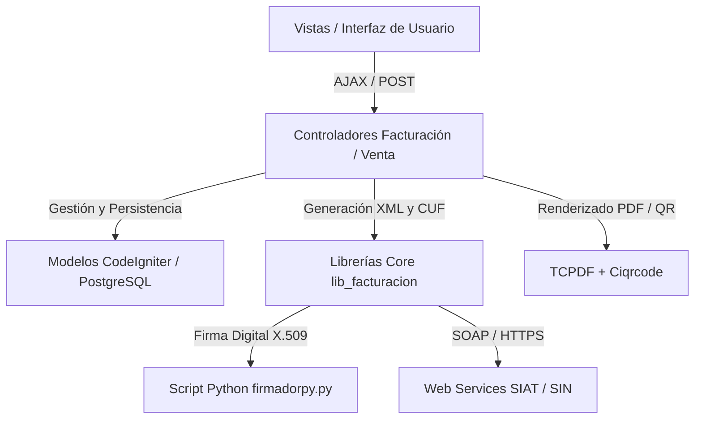

# 📊 Análisis Integral del Módulo de Facturación (SIAT - SIN Bolivia)

> ⚠️ **DOCUMENTO OBSOLETO (2026-09-16):** describe `FactuPlus` en CodeIgniter 3 + PostgreSQL + firma con Python. El sistema actual es **Laravel 13 + MySQL** (`app/Services/SiatService.php`, firma XMLDSig en PHP con OpenSSL). Se conserva solo como referencia histórica del dominio fiscal. La documentación vigente es `DOCUMENTACION_TECNICA_ENTREGA-GISECA.md`.

Este documento detalla la arquitectura, submódulos, variables de control, flujo de datos, integraciones externas (SOAP, XMLDSig, Python) y esquema de base de datos del **Módulo de Facturación** del sistema **FactuPlus**.

---

## 1. Arquitectura General y Tecnologías

El sistema implementa el estándar del **Servicio de Impuestos Nacionales (SIN)** de Bolivia bajo la normativa del **SIAT (Sistema Integrado de la Administración Tributaria)**.



### Stack Técnico del Módulo:
* **Backend:** PHP 7.4 (CodeIgniter 3.1.8) con extensiones `soap`, `openssl`, `curl`, `pdo_pgsql`, `pgsql`.
* **Firma Digital:** Python 3.8+ con librerías `signxml` y `lxml` (ejecutado por CLI mediante `exec()` / `shell_exec()`).
* **Base de Datos:** PostgreSQL 13+ (con triggers, funciones almacenadas y tablas relacionales).
* **Protocolo de Comunicación Tributaria:** SOAP 1.2 / WSDL oficial del SIN con seguridad por Token Delegado.

---

## 2. Submódulos de Facturación

El módulo se compone de **9 submódulos clave** distribuidos entre `application/controllers/facturacion/` y `application/controllers/venta/`:

### 2.1. Configuración General SIAT (`C_configuracion.php`)
* **Propósito:** Parametrizar las credenciales tributarias de la empresa y la modalidad de emisión.
* **Funciones Clave:**
  * `C_datos_sistema()`: Carga los parámetros actuales desde la BD (`cat_facturacion`).
  * `C_gestionar_sistema($btn)`: Registra o actualiza el NIT, Código de Sistema, Token delegado, Código de Ambiente, Modalidad y CAFC.
  * Carga de llaves/certificados criptográficos (`.crt`, `.pem`, `.pk`, `.p12`) en `assets/llaves/` para Facturación Electrónica en Línea.
  * Validación inicial realizando solicitud de prueba de **CUIS** hacia el SIN.

### 2.2. Gestión de Sucursales (`C_sucursal.php`)
* **Propósito:** Administrar la Casa Matriz (Código 0) y las sucursales tributarias (1, 2, ...).
* **Funciones Clave:**
  * Registro y sincronización de códigos de sucursal ante el SIAT.
  * Solicitud y almacenamiento de CUIS por sucursal.
  * Homologación de actividades económicas por sucursal.

### 2.3. Puntos de Venta y Gestión de Códigos (`C_punto_venta.php`)
* **Propósito:** Administrar los Puntos de Venta (POS, Web, Móvil, etc.), asociarlos a cajas/ubicaciones físicas y gestionar el ciclo de vida de los códigos diarios (**CUFD**) e institucionales (**CUIS**).
* **Funciones Clave:**
  * `C_registrar_cuis($codigoPuntoVenta)`: Solicita al SIAT el Código Único de Inicio de Sistemas (vigencia 1 año).
  * `C_generar_cufd()` / `C_generar_cufds()`: Solicita el Código Único de Facturación Diaria (vigencia 24 horas) con su código de control.
  * `cierrePuntoVenta()` / `registrarCierrePuntoVenta()`: Notifica al SIAT la baja o cierre de un punto de venta.
  * `C_verificador_eventos()`: Monitorea el estado de contingencia y empaqueta lotes pendientes.

### 2.4. Emisión de Venta Facturada en Línea (`C_venta_facturada.php`)
* **Propósito:** Flujo principal de facturación en el momento de la venta.
* **Funcionalidad:**
  1. Validación del NIT/CI contra el SIAT (verificación de dígitos y estado activo).
  2. Generación del **CUF** (Código Único de Facturación de 64 caracteres) mediante `GeneradorCuf.php`.
  3. Construcción del archivo XML del documento sector (Factura Compra-Venta Estándar) mediante `GeneradorXml.php`.
  4. Firma electrónica del XML con `firmadorpy.py` (si la modalidad es Electrónica en Línea).
  5. Compresión del XML en formato `.gz` y codificación en Base64.
  6. Envío SOAP al WebService `recepcionFactura` del SIAT.
  7. Si la recepción es exitosa (`codigoRecepcion`), se almacena la transacción, se genera el **Código QR** tributario y se emite la factura en PDF (carta o rollo/térmica).
  8. Envío automático de la factura digital y XML al correo electrónico del cliente.

### 2.5. Facturación Manual y Fuera de Línea (`C_factura_manual.php`)
* **Propósito:** Emisión de facturas cuando el punto de venta opera sin conexión o mediante talonario de contingencia con CAFC.
* **Funciones Clave:**
  * Emisión fuera de línea asociando el CUFD de contingencia o CAFC vigente.
  * Registro diferido para su posterior regularización y empaquetamiento masivo.

### 2.6. Eventos Significativos y Contingencia (`C_eventos_contigencia.php`, `C_eventos_sin_linea.php`)
* **Propósito:** Gestión de incidentes tributarios (corte de energía, corte de internet, caída de servidores del SIN, virus/bloqueo, etc., códigos de evento 1 al 7).
* **Funciones Clave:**
  * `C_registrar_inicio_evento()`: Registra ante el SIN el inicio del evento de contingencia.
  * `C_registrar_evento_fin()`: Registra la fecha/hora de finalización del evento.
  * `C_empaquetar_validar_facturas()`: Agrupa las facturas emitidas durante el corte en un archivo comprimido (`.tar.gz`).
  * `C_emitir_paquete()`: Envía el paquete masivo al endpoint `recepcionPaqueteFactura` y valida la recepción con `validarPaquete`.

### 2.7. Anulación y Reversión de Facturas (`C_anulacion.php`)
* **Propósito:** Cancelación oficial de comprobantes fiscales ya recepcionados por Impuestos.
* **Funciones Clave:**
  * `C_anular_factura()`: Envía al SIAT la solicitud de anulación especificando el CUF y el código de motivo de anulación (ej. 1: Factura mal emitida, 2: Datos de emisión incorrectos, 3: Devolución).
  * `C_reversion_anulacion_factura()`: Revierte una anulación previa dentro del plazo permitido.
  * `C_enviar_correo()`: Notifica al cliente por correo electrónico el cambio de estado de su factura.
  * Exportación del reporte de anulaciones en formatos PDF y Excel.

### 2.8. Sincronización de Catálogos Paramétricos (`C_sincronizacion.php`, `C_catalogos.php`)
* **Propósito:** Descargar y actualizar periódicamente desde el SIN los catálogos oficiales:
  * Actividades económicas homologadas.
  * Lista de productos y servicios SIN.
  * Tipos de documento de identidad (CI, NIT, Pasaporte, CEX).
  * Tipos de emisión y documentos de sector.
  * Métodos de pago (Efectivo, Tarjeta, QR, Transferencia, etc.).
  * Mensajes y leyendas para facturas.
  * Motivos de anulación y tipos de eventos significativos.

### 2.9. Listado y Reportes de Facturas (`C_listado_facturas.php`)
* **Propósito:** Control operativo, auditoría y reimpresión de comprobantes fiscales.
* **Funciones Clave:**
  * Filtrado por rangos de fecha, sucursal, punto de venta, usuario y estado (Válida, Anulada, En Contingencia).
  * Reimpresión de formatos PDF (Carta, Medio Oficio, Rollo 80mm/58mm).
  * Descarga directa del XML firmado y reenvió por correo.

---

## 3. Librerías del Núcleo (`application/libraries/lib_facturacion/`)

| Archivo / Clase | Responsabilidad Principal |
|---|---|
| [`Codigos.php`](file:///c:/xampp/htdocs/factuplus/application/libraries/lib_facturacion/Codigos.php) | Conexión SOAP para obtención y verificación de **CUIS**, **CUFD** y pruebas de comunicación (`verificarComunicacion`). |
| [`FacturacionCompraVenta.php`](file:///c:/xampp/htdocs/factuplus/application/libraries/lib_facturacion/FacturacionCompraVenta.php) | Endpoints SOAP para: `recepcionFactura`, `recepcionPaqueteFactura`, `recepcionMasivaFactura`, `validacionPaqueteFactura`, `anulacionFactura` y `reversionAnulacionFactura`. |
| [`GeneradorCuf.php`](file:///c:/xampp/htdocs/factuplus/application/libraries/lib_facturacion/GeneradorCuf.php) | Implementación del algoritmo matemático del SIN para generar el **CUF**: armado de la cadena hexadecimal + cálculo de dígito verificador **Módulo 11**. |
| [`GeneradorXml.php`](file:///c:/xampp/htdocs/factuplus/application/libraries/lib_facturacion/GeneradorXml.php) | Serializador XML para documentos sector (cabecera, detalle, montos, descuentos, método de pago, leyendas) conforme a los esquemas XSD del SIN. |
| [`firmadorpy.py`](file:///c:/xampp/htdocs/factuplus/application/libraries/lib_facturacion/firmadorpy.py) | Script en Python que firma el XML usando **XMLDSig Enveloped** (algoritmo Canonicalization C14N y SHA-256) con las llaves privadas del contribuyente. |
| [`Sincronizacion.php`](file:///c:/xampp/htdocs/factuplus/application/libraries/lib_facturacion/Sincronizacion.php) | Consumo de WebServices de catálogos y sincronización de tablas maestras del SIN. |
| [`Operaciones.php`](file:///c:/xampp/htdocs/factuplus/application/libraries/lib_facturacion/Operaciones.php) | Peticiones para registro de puntos de venta, cierre de operaciones y registro de eventos. |
| [`ConvertidorLetras.php`](file:///c:/xampp/htdocs/factuplus/application/libraries/lib_facturacion/ConvertidorLetras.php) | Convierte importes numéricos a texto literal en bolivianos (ej. `SON: CIENTO VEINTE 00/100 BOLIVIANOS`). |

---

## 4. Variables de Control y Parámetros del Sistema

### 4.1. Variables de Configuración Tributaria (`cat_facturacion`)
* `nit`: Número de Identificación Tributaria del emisor.
* `codigo_sistema`: Código alfanumérico otorgado por el SIN tras la certificación del software.
* `codigo_ambiente`:
  * `1` = Producción (Servidores reales del SIN).
  * `2` = Piloto / Pruebas.
* `codigo_modalidad`:
  * `1` = Electrónica en Línea (Usa certificados digitales y firma XMLDSig con Python).
  * `2` = Computarizada en Línea (Usa hash de seguridad sin certificados X.509).
* `codigo_emision`:
  * `1` = En Línea.
  * `2` = Fuera de Línea (Contingencia).
  * `3` = Masiva.
* `token`: Token delegado de autenticación generado en el portal del contribuyente SIAT.
* `cafc_fcv` / `cafc_fcvt`: Código de Autorización de Facturas por Contingencia y sus rangos permitidos.

### 4.2. Códigos Temporales y Transaccionales
* `cuis`: Código Único de Inicio de Sistemas (válido por 365 días por sucursal y punto de venta).
* `cufd`: Código Único de Facturación Diaria (válido por 24 horas).
* `codigo_control`: Código de control criptográfico asociado al CUFD.
* `cuf`: Código Único de Facturación (64 caracteres) asignado unívocamente a cada factura emitida.
* `codigo_recepcion`: Hash/identificador devuelto por el WebService del SIN que confirma la validez de la factura.

### 4.3. Variables de Sesión y Contexto de Usuario
* `id_usuario`: ID del operador que emite el documento.
* `login`: Nombre de usuario (queda registrado en `usucre` de las transacciones).
* `id_proyecto` (en `seg_usuario`): Mapea a `id_ubicacion` en `cat_ubicaciones`, determinando a qué sucursal y punto de venta pertenece la caja activa.

---

## 5. Principales Tablas de Base de Datos Involucradas

```
┌─────────────────────────┐         ┌─────────────────────────┐
│     cat_facturacion     │ 1 ────* │       cat_sucursal      │
│ (NIT, Token, Modalidad) │         │   (Código de Sucursal)  │
└─────────────────────────┘         └─────────────────────────┘
             │                                   │
             │ 1                                 │ 1
             ▼ *                                 ▼ *
┌─────────────────────────┐         ┌─────────────────────────┐
│         cat_cuis        │         │     cat_ubicaciones     │
│   (CUIS, Punto Venta)   │         │  (Cajas, Punto Venta)   │
└─────────────────────────┘         └─────────────────────────┘
             │                                   │
             │ 1                                 │ 1
             ▼ *                                 ▼ *
┌─────────────────────────┐         ┌─────────────────────────┐
│   cat_cufd / ope_cufd   │         │        mov_venta        │
│ (CUFD diario, Vencim.)  │         │ (Cabecera de Factura/V) │
└─────────────────────────┘         └─────────────────────────┘
                                                 │ 1
                                                 ▼ *
                                    ┌─────────────────────────┐
                                    │    mov_facturadetalle   │
                                    │  (Items, Precios, SIN)  │
                                    └─────────────────────────┘
```

1. **`cat_facturacion`**: Guarda la configuración tributaria global (NIT, token, ambiente, modalidad, llaves).
2. **`cat_sucursal`**: Registro de sucursales autorizadas.
3. **`cat_ubicaciones`**: Asocia ubicaciones físicas internas con el `id_sucursal` y `codigo_punto_venta`.
4. **`cat_cuis`**: Historial y estado activo de códigos CUIS.
5. **`cat_cufd` / `ope_cufd`**: Almacén de códigos diarios CUFD con fecha de creación y vencimiento.
6. **`cat_tipo_eventos` / `ope_eventos`**: Registro de aperturas y cierres de eventos de contingencia.
7. **`cat_catalogo`**: Cache local de catálogos sincronizados del SIN en formato JSON / relacional.
8. **`mov_venta` / `mov_factura`**: Registro transaccional de facturas emitidas (guarda CUF, XML, código de recepción, estado `VALIDADA`/`ANULADA`, etc.).
9. **`mov_facturadetalle`**: Detalle de productos vendidos homologados con el código de producto SIN y unidad de medida.
